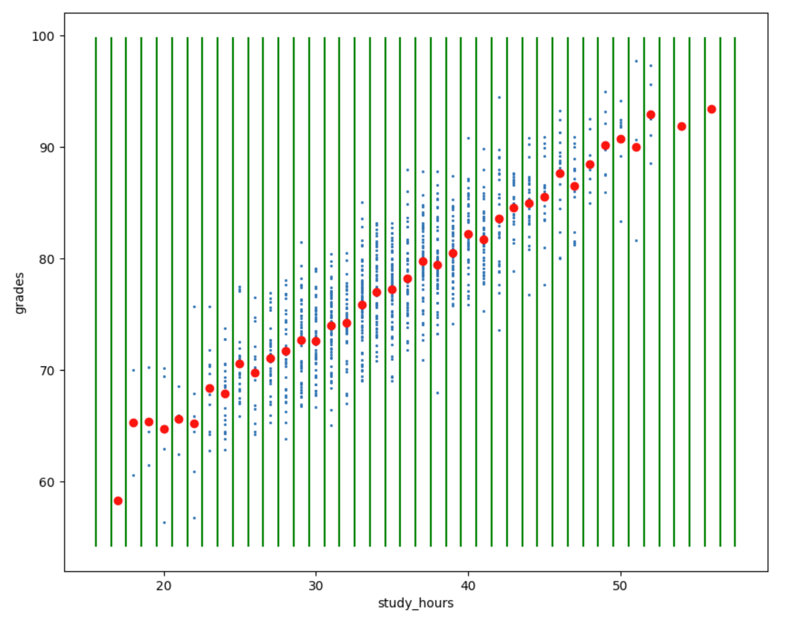
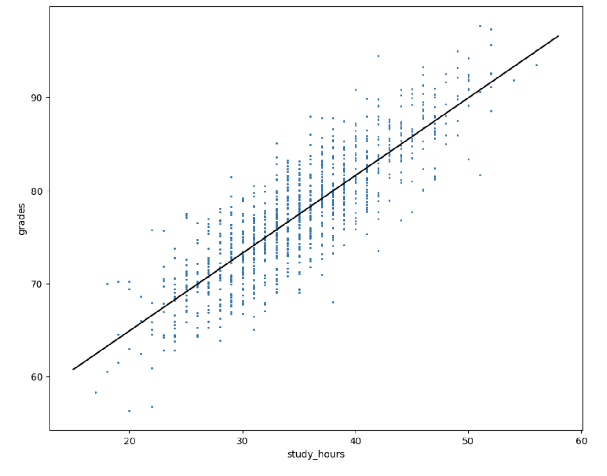

This repo is for CSCI 4120.

**Name:** Connell Leon

**Email:** leonc22@students.ecu.edu

## Quick Start

Download the HW3 file into your virtual enviroment location
```
git clone https://github.com/caleon0306/csci4120-nogroup-leonc22.git
```

Activate the virtual environment:
```
source bin/activate
```

Install Requirements:
```
pip3 install -r csci4120-nogroup-leonc22/HW3/requirements.txt
```

Start Jupyter Notebook:
```
jupyter notebook
```

Jupyter Notebook takes you to an incorrect link.
Link to main:
http://127.0.0.1:8888/tree/csci4120-nogroup-leonc22

Link to HW3:
http://127.0.0.1:8888/notebooks/csci4120-nogroup-leonc22/HW3/HW_linear_regression/HW_1.ipynb

**Exercise 1 Picture**


**Exercise 2 Picture**

